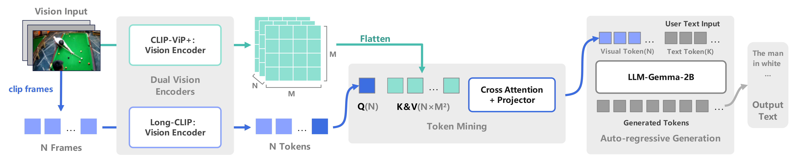

#### HiLight 



[[2407.07325\] HiLight: Technical Report on the Motern AI Video Language Model (arxiv.org)](https://arxiv.org/abs/2407.07325)

This is a video-language model where the dual-tower structure of the visual extractor comprises a CLIP-ViP video feature extractor and a Long-CLIP image feature extractor. The features obtained are fused through the TokenMining module and then passed to the language model Gemma-2B for generation.

#### AutoDL Deployment(Recommendation)

1.Load our public image on the AutoDL cloud server:


2.Make sure model weight exit in /root/autodl-tmp/ .

Since the AutoDL system disk only has 30GB and our model weights are approximately 9GB each, the image cannot include the model weights. Therefore, you will need to store the downloaded weights separately on the AutoDL data disk(/root/autodl-tmp).

```
/root/autodl-tmp
├──HiLight-2B-LoRA-Merge-stage2-M101K-2epoch
├──HiLight-2B-LoRA-Merge-stage2-VT1K-2epoch
├──HiLight-2B-LoRA-Merge-stage2-tune(TM+LLM)M101K-3epoch
├──HiLight-2B-LoRA-Merge-stage2-tune(TM+LLM)VT1K-2epoch
```

please download model weight from Huggingface: [ATA-space/HiLight](https://huggingface.co/ATA-space/HiLight/tree/main) , and put in right path.

after that, you can run webui_demo.py .

#### Local Deployment

1.Enter the root directory to install the environment. 

- PyTorch 2.1.0

- Python  3.10(ubuntu22.04)

- Cuda  12.1

```cmd
pip install -r requirements.txt
```

2.Make sure model weight exit in this path. 

```
HiLight
├──data
├──hilight
├──scripts
├──model_zoo
│   ├──CLIP-ViP
│   │   ├──clipvip-vision_config.json
│   │   ├──pretrain_clipvip_base_16.pt
│   ├──LLM
│   │   ├──gemma
│   │   │   ├──tokenizer
│   ├──Long-CLIP
│   │   ├──longclip-B.pt
│   ├──TokenMining
│   │   ├──[only stage2 training need tokenmining.bin(stage1 training output)]
├──work_dirs
│   ├──HiLight-2B-LoRA-Merge-stage2-M101K-2epoch
│   ├──HiLight-2B-LoRA-Merge-stage2-VT1K-2epoch
│   ├──HiLight-2B-LoRA-Merge-stage2-tune(TM+LLM)M101K-3epoch
│   ├──HiLight-2B-LoRA-Merge-stage2-tune(TM+LLM)VT1K-2epoch
```

please download model weight from Huggingface: [ATA-space/HiLight](https://huggingface.co/ATA-space/HiLight/tree/main) , and put in right path.

#### WebUI Inference(Recommendation)

```cmd
python webui_demo.py
```

#### CLI Inference

We did not continue debugging the predict_cli.py script, so you may need to modify the weight path in the code yourself.

```cmd
python predict_cli.py --videos_file <path to your video>
```

#### Train

The training process consists of two stages: (1) feature alignment stage: bridge the vision and language tokens; (2) instruction tuning stage: teach the model to follow multimodal instructions.

1.Grant script execution permissions. 

```cmd
chmod +x scripts/gemma/train/ds_HiLight_gemma_train_GPUs_stage2.sh
chmod +x scripts/gemma/train/ds_HiLight_gemma_train_GPUs.sh
```

2.Set NCCL. 

```cmd
export NCCL_P2P_DISABLE=1
export NCCL_IB_DISABLE=1
```

3.Configure .sh script parameters.

```python
# in scripts/gemma/train/
--data_path  # Train data json path
--val_path  # Val data json path
--video_folder  # Train data video(.pkl) folder
--val_folder  # val data video(.pkl) folder

--output_dir  # model weight output
```

4.Run DeepSpeed on a single machine with multiple GPUs. 

Stage1: only train TokenMining. 

```cmd
scripts/gemma/train/ds_HiLight_gemma_train_GPUs.sh
```

Stage2: train LoRA-LLM(optionally tune TokenMining). 

```cmd
scripts/gemma/train/ds_HiLight_gemma_train_GPUs_stage2.sh
```

